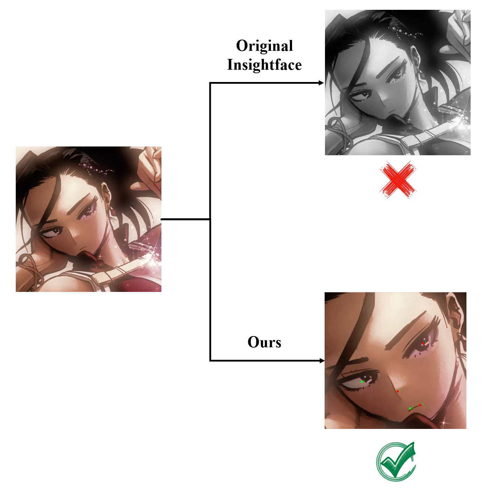
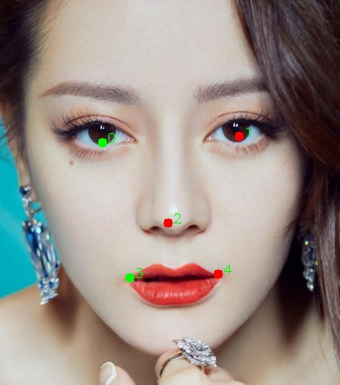

# Embedding and Keypoints Extractor for Real and Anime Face



FaceEKE is a specialized method for extracting face embeddings and keypoints (KPS) from input character images. It is based on the open-source `Insightface`  model and can handle over 90% of face embedding extraction tasks. For more challenging cases, such as detecting anime faces, we use the [Anime Face Detector](https://github.com/hysts/anime-face-detector) model for landmark detection. This approach can ultimately be adapted for embedding extraction with `antelopev2` model.

FaceEKE provides a solution for embedding extraction in downstream tasks such as face alignment, face swapping, and FaceID generation, especially for anime faces.

---

## How to run

```
git clone https://github.com/ykj467422034/FaceEKE.git
cd face_embedding_extractor
pip install -r requirements.txt
python extract_face_embedding.py
```

### Demos

|              Image              |             face and kps             |
| :------------------------------: | :----------------------------------: |
|  |  |
|  |  |

### Acknowledgements

FaceEKE is developed by KUNLUN Skyworker AIStory team, all copyright reserved.
Thanks to [insightface](https://github.com/deepinsight/insightface) for provide face embedding model.
Thanks to [anime-face-detector](https://github.com/hysts/anime-face-detector) for anime face detect.
